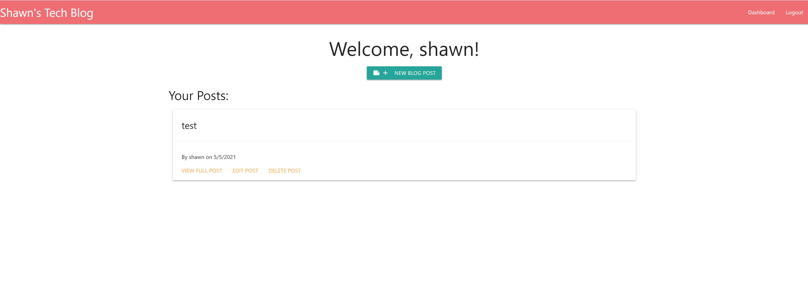

# Tech Blog
---
    
    
                  
---

    
## Table Of Contents
---
* [Installation](#installation)
* [Usage](#usage)
* [Licensing](#licensing)
* [Contribute To This Project](#contribute)
* [Questions and Contact Info](#questions-and-contact)

    
## Description
---
A full-stack application to blog about tech news, notes, developments, etc.
    

    
## Installation
---
This app is fully functional on Heroku.  No install required.

    
## Usage
---
Create a user account, then blog to your heart's content!  You may also comment on other posts by viewing them.

### Screenshots
---
Landing Page

---
Dashboard

---
Viewing a full post & comments

---
Editing a post

    
    
## Licensing
---
Copyright 2021 Shawn Littrel 
    
    Permission is hereby granted, free of charge, to any person obtaining a copy of this software and associated documentation files (the "Software"), to deal in the Software without restriction, including without limitation the rights to use, copy, modify, merge, publish, distribute, sublicense, and/or sell copies of the Software, and to permit persons to whom the Software is furnished to do so, subject to the following conditions:  
        
    The above copyright notice and this permission notice shall be included in all copies or substantial portions of the Software. 
        
    THE SOFTWARE IS PROVIDED "AS IS", WITHOUT WARRANTY OF ANY KIND, EXPRESS OR IMPLIED, INCLUDING BUT NOT LIMITED TO THE WARRANTIES OF MERCHANTABILITY, FITNESS FOR A PARTICULAR PURPOSE AND NONINFRINGEMENT. IN NO EVENT SHALL THE AUTHORS OR COPYRIGHT HOLDERS BE LIABLE FOR ANY CLAIM, DAMAGES OR OTHER LIABILITY, WHETHER IN AN ACTION OF CONTRACT, TORT OR OTHERWISE, ARISING FROM, OUT OF OR IN CONNECTION WITH THE SOFTWARE OR THE USE OR OTHER DEALINGS IN THE SOFTWARE.

    
    
    
## Contribute
---
Want to contribute to this project?  Please make a pull request at www.github.com/shawnlittrel/tech-blog-mvc

    
## Questions And Contact
---
* Author: [Shawn Littrel](www.github.com/shawnlittrel)
* GitHub: (www.github.com/shawnlittrel/tech-blog-mvc)
* Email: shawnlittrel
    
    